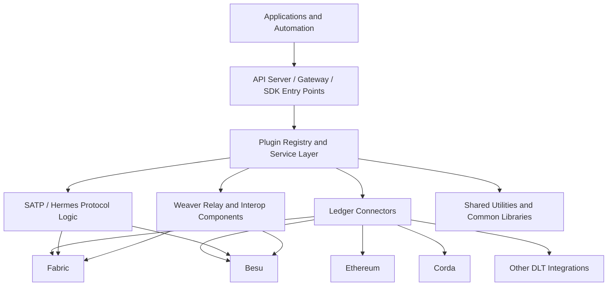
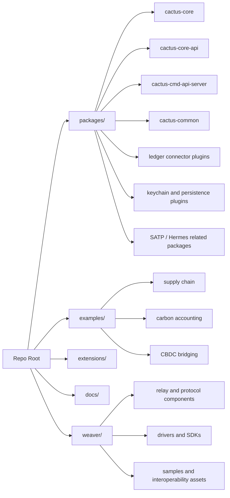

# Hyperledger Cacti Architecture Overview

## What Hyperledger Cacti Is

Hyperledger Cacti is a pluggable interoperability framework for coordinating secure, decentralized interactions across heterogeneous blockchain and DLT networks such as Hyperledger Fabric, Besu, Corda, Ethereum, and related systems. It was created by merging two earlier systems, **Hyperledger Cactus** and **Weaver**, into a single project with a shared release, documentation, and community direction.

That merger is the most important architectural fact for a new contributor. Cacti is already one project from a packaging and governance perspective, but it still carries two historical implementation styles:

- A **Cactus-style** model centered on an API server, plugin registry, and ledger-specific connectors.
- A **Weaver-style** model centered on relays, interoperability protocols, SDKs, and cross-network transaction flows.

The result is powerful, but it also creates contributor friction because the codebase is still partly aggregated rather than deeply unified. Understanding that tension is the key to understanding both the architecture and the mentorship issue.

## Architecture in One Paragraph

Cacti is best understood as a layered interoperability system. At the bottom are heterogeneous ledgers and their native smart contracts or chaincode. Above that are ledger-specific connectors, protocol implementations, and supporting SDKs. On top of those sit orchestration components such as the API server, plugin registry, gateway services, relays, and SATP-related modules. Together they let applications perform actions such as reading remote state, invoking contracts, coordinating asset transfer, and auditing cross-network sessions without requiring a central settlement chain.

## High-Level Architecture

## Codebase-Oriented View

## Core Architectural Pieces

### 1. API Server and Configuration-Driven Runtime

The most visible runtime entry point on the Cactus side is the API server, exposed through `packages/cactus-cmd-api-server`. The server starts from a generated configuration file, initializes a plugin registry, and loads plugin packages dynamically.

That behavior showed up directly in local validation:

- `npm run generate-api-server-config` only worked after the backend build generated the required `config-service.js` artifact.
- `npm run start:api-server` validated the configuration and started loading the `@hyperledger/cactus-plugin-keychain-memory` plugin.

This tells a contributor two important things:

1. The API server is a real runtime hub, not just an auxiliary package.
2. The developer workflow has an implicit build-order dependency that is not obvious enough from the current docs.

### 2. Plugin Model

The plugin model is the main mechanism Cacti uses to remain pluggable across ledgers and capabilities. Plugins let the framework add connectors, keychains, persistence layers, and other services without requiring one monolithic core implementation.

Examples visible in the repo structure include:

- Ledger connector plugins for Besu, Fabric, Ethereum, Corda, Polkadot, Sawtooth, Stellar, and others.
- Keychain plugins such as memory, Vault, AWS Secrets Manager, Azure Key Vault, and Google Secret Manager.
- Persistence plugins and consortium-related plugins.

Architecturally, this means Cacti does not treat interoperability as one hardcoded protocol path. Instead, it assembles capabilities from replaceable components.

### 3. Ledger Connectors

Ledger connectors are the DLT-specific integration points. They translate generic framework actions into ledger-native operations such as querying state, deploying contracts, invoking transactions, or managing credentials and identities.

For a new contributor, the main idea is:

- The **framework** defines the orchestration shape.
- The **connector** handles the ledger-specific execution details.

This split is one reason Cacti can support many networks without pretending they all behave the same way.

### 4. Weaver-Derived Interoperability Components

The `weaver/` tree preserves the relay, protocol, driver, SDK, and sample code that came from the Weaver side of the merger. This is where a contributor encounters the more protocol-centric style of interoperability logic.

Weaver-derived pieces matter because they embody a different interoperability model than the API-server-first Cactus approach:

- More emphasis on relays and protocol exchange.
- More explicit cross-network trust and proof handling.
- SDK and driver support for specific interoperability flows.

That is why the Cacti architecture cannot be reduced to "an API server plus connectors." The Weaver side contributes a separate but related orchestration model that still needs clearer unification in the docs and source layout.

### 5. SATP and Hermes

SATP, the Secure Asset Transfer Protocol, is one of the strongest architectural examples of what the merger enables. The SATP-related packages and demos show how Cacti can coordinate multi-stage, auditable asset transfers across independent networks.

From the contributor perspective, SATP is useful because it surfaces several architectural layers at once:

- Local or remote ledgers
- Smart contracts
- Gateway services
- Protocol messages
- Session status and auditing
- Cross-network trust assumptions

That is why the SATP demos are strong onboarding material and why the mentorship issue overlaps so naturally with SATP-oriented documentation work.

### 6. Examples and Demos

The `examples/` directory in the main repo and the separate `cacti-demos` repository play an architectural role, not just a tutorial role. They are the places where the abstract promises of the framework become concrete workflows.

Examples help answer questions such as:

- Which entrypoint should I run first?
- What does a successful end-to-end flow look like?
- Which plugins and services are actually meant to work together?

That matters because Cacti's main architectural challenge is not a lack of capability. It is the difficulty of helping contributors discover the right path through the capability surface.

## Post-Merger Structure: What Came From Where

The cleanest mental model for a new contributor is this:

| Area | Primary historical origin | Current role in Cacti |
| --- | --- | --- |
| API server and plugin-oriented runtime | Cactus | Main configurable runtime and local orchestration entrypoint |
| Ledger connector ecosystem | Cactus | DLT-specific integration points |
| Relay and protocol-oriented interop logic | Weaver | Cross-network coordination model and interoperability machinery |
| SDKs, drivers, and protocol samples | Weaver | Developer tooling and cross-network support assets |
| Unified branding, packaging, release direction | Post-merger Cacti | Shared project identity and roadmap |

This table is intentionally approximate rather than absolute. The point is not to freeze ownership by historical project, but to help contributors understand why the repo still feels like two systems meeting in one codebase.

## How Cacti Differs From Pre-Merger Hyperledger Cactus

Compared with legacy Hyperledger Cactus alone, post-merger Cacti has:

- A broader interoperability story that goes beyond plugin-based API access.
- A direct inheritance of Weaver concepts such as relay-centered flows and richer protocol machinery.
- A larger and more complex codebase with more contributor navigation cost.
- A clearer project-level vision around network-of-networks interoperability.

In short, Cacti is not just "Cactus with more connectors." It is a broader interoperability framework that now includes multiple orchestration styles and trust models.

## How Cacti Differs From Pre-Merger Weaver

Compared with legacy Weaver alone, post-merger Cacti has:

- A stronger plugin-centered runtime model.
- A more direct Node and TypeScript monorepo experience for many contributor workflows.
- A larger catalog of reusable connectors, examples, and supporting runtime components.
- A combined contributor surface that spans protocol logic and application-facing APIs.

In short, Cacti is not just "Weaver with rebranding." It combines protocol-heavy interoperability concepts with a pluginized service architecture.

## What the Local CLI Validation Revealed

The architecture is not just visible in documents; it is visible in the command behavior:

- The build produced backend artifacts across many packages, which shows the monorepo's breadth.
- The API config generation step depended on compiled server artifacts, which exposed a hidden dependency between build and runtime setup.
- The API server successfully loaded a plugin, which confirmed that the plugin registry path is central to actual runtime behavior.
- A TypeScript unit test failed under Node 20 with `ERR_UNKNOWN_FILE_EXTENSION`, which suggests that the architecture and tooling still have version and runtime-standardization gaps.
- The `cacti-demos` Makefile expecting Node `18.19.0` while the main repo build ran under Node `20.20.2` is a concrete example of cross-repo contributor friction.

These are not just operational notes. They are architecture-adjacent signals:

- Build layers are tightly coupled.
- Runtime behavior depends on generated artifacts.
- Plugin loading works, but surrounding developer ergonomics still need cleanup.

## Why This Architecture Is Powerful

Despite the contributor friction, the architecture has several strengths:

- It supports heterogeneous ledgers without forcing one trust model on every workflow.
- It allows functionality to be added through plugins instead of bloating the core.
- It supports both application-facing integration paths and deeper protocol-driven interoperability paths.
- It offers real end-to-end demonstrations of cross-network coordination, especially through SATP and gateway demos.

Those strengths are exactly why the repository is worth improving. The architecture already contains serious capability. The usability problem is making that capability accessible.

## Why This Architecture Is Hard for Contributors

The main contributor challenges are:

- The code layout still reflects the merger history.
- The architecture docs rely too heavily on diagrams and not enough on code-to-concept mapping.
- The build, runtime, and demo environments do not communicate their assumptions clearly enough.
- Different parts of the ecosystem appear to assume different Node/runtime baselines.
- The framework is modular, but the contributor entry path is not yet modular enough.

That is why Issue #62 is not just a documentation task. It is an architecture communication task.

## Contributor-Focused Summary

If I had to explain Cacti to a new contributor in a few sentences, I would say:

Hyperledger Cacti is a post-merger interoperability platform that combines Cactus-style plugin orchestration with Weaver-style protocol-driven cross-network coordination. The practical entrypoint is usually the API server and its plugin ecosystem, but the deeper interoperability story includes relays, SATP flows, SDKs, and gateway services. The biggest challenge today is not what the architecture can do, but how difficult it still is for a new contributor to discover the right path through it.
