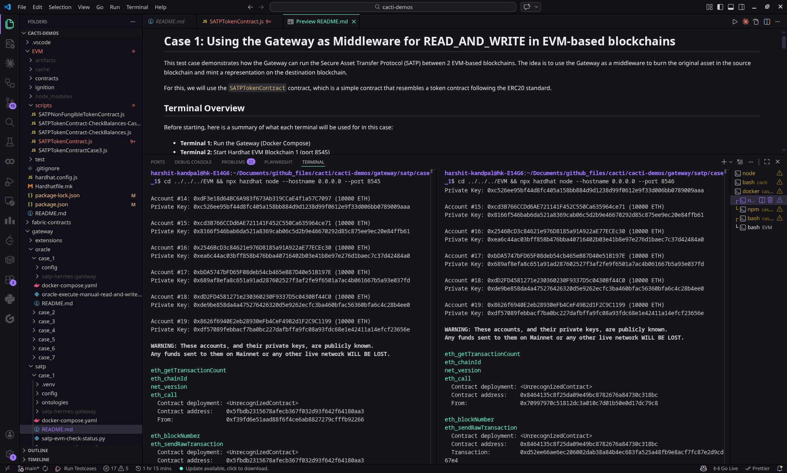
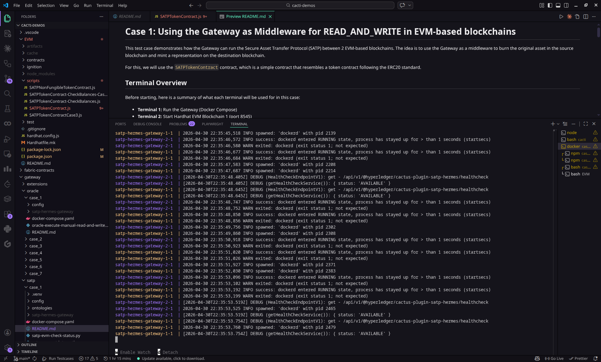
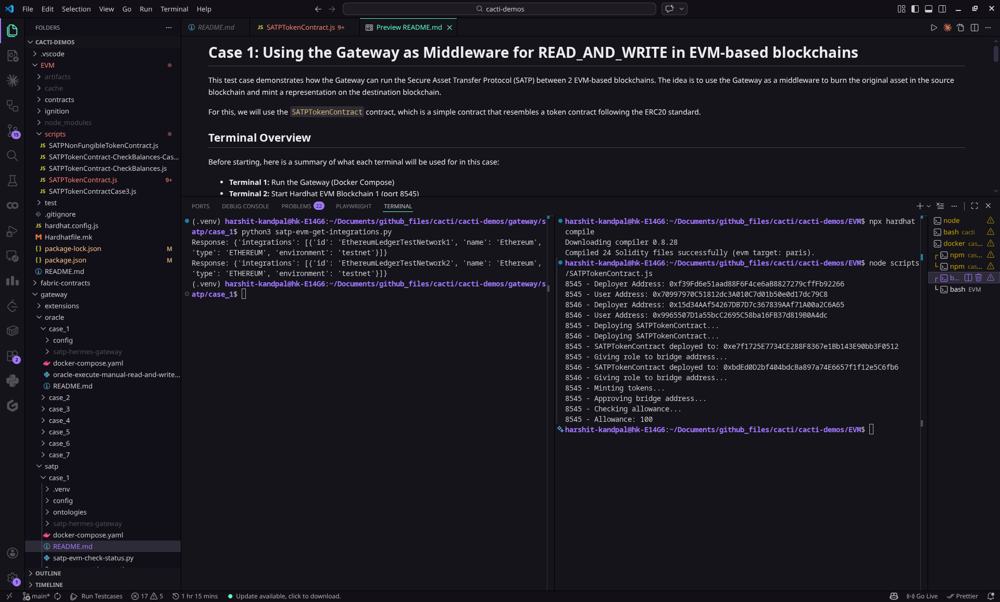
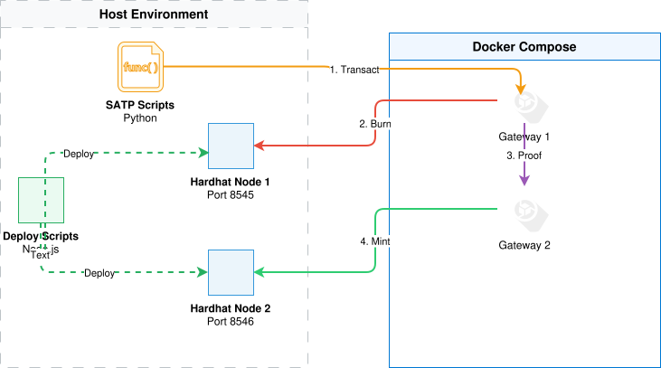

# Cacti Demo End-to-End Run: SATP Gateway (`gateway/satp/case_1`)

## What drew you to this demo?


I selected `gateway/satp/case_1` from `hyperledger-cacti/cacti-demos` because it demonstrates one of Cacti’s core value propositions: **interoperability via the Secure Asset Transfer Protocol (SATP)**. Instead of just reading/writing to a single chain, this case exercises a realistic cross-chain flow: **burn on a source EVM chain** and **mint a representation on a destination EVM chain**, mediated by two Cacti gateways. I also liked that the demo includes explicit **status tracking** (`SESSION_ID`) and an **audit endpoint/script**, which makes the run observable and verifiable.

## Running the Demo

I followed the `gateway/satp/case_1/README.md` and orchestrated the transfer using a five-terminal setup. Below is the breakdown of the components and the issues resolved during the run.

### 1. Blockchain Infrastructure (Terminals 2 & 3)

Launched independent **Hardhat EVM nodes** locally.  
### 2. Cacti Middleware (Terminal 1)

I initiated the **Cacti Gateways** via Docker Compose.  

### 3. Contract Deployment (Terminal 4)

I deployed the **SATPTokenContract** to both networks. This step established the ERC20 tokens on the local blockchains and automatically configured the `SATPWrapper` bridge contracts required for the transfer.Also executed satp-evm-get-integrations.py within a Python virtual environment to verify that both blockchain networks are successfully connected to the Cacti gateways.


## What happened under the hood? 
First, we launch two independent Hardhat nodes, which are local testing tools acting as our simulating blockchains to serve as the source and destination networks. Once these are running, we use a deployment script to place an SATPTokenContract on both networks to handle the asset math. From what I understand,here cacti acts as a middleware plugin; it deploys two containerized SATP Gateways that act as digital security guards. To talk to these contracts, Cacti uses an RPC (Remote Procedure Call) , which is the digital "phone line" that allows the software to dial into the blockchain and give it instruction

When you initiate a transfer, the gateways follow SAecure Asset Transfer Protocol to move value without actually "sending" data through a wire. Gateway 1 instructs the source Hardhat node to burn the specified tokens, removing them from circulation. Inside the Docker environment, Gateway 1 generates a cryptographic "Proof of Burn" and transmits it to Gateway 2. Throughout this, the Ontology file mapped into the Docker containers acts as a translation map, telling the gateways exactly which functions to call on your local smart contracts to ensure the move is secure.



## What did I learn?

- Complexity of Cross-Chain Interoperability: I learned that secure asset transfer requires a complex protocol with distinct commit, transfer, and finalization phases. Managing this across heterogeneous distributed ledgers requires robust middleware that can handle both the on-chain operations (burn/mint) and the off-chain cryptographic proofs.

- Cacti’s Middleware Value: This demo build more of my understanding of Cacti’s role as an abstraction layer. It standardizes the SATP implementation so developers don't have to build custom, chain-specific logic for every bridge. Its focus on auditability and verifiable state tracking is a clear differentiator for enterprise applications requiring high transparency.
<!-- 
### Running the Components

The demo is easiest to run with five terminals, each dedicated to a component (this mapping matches the case README):

1.  **Terminal 2 & 3 (Hardhat EVM Blockchains):** I started two Hardhat nodes, simulating two distinct EVM-based blockchains. It was critical to use `--hostname 0.0.0.0` to allow access from within Docker containers. 

    (containes docker compose)[./Task1.png]

    (npx hardhart compils and ran satp token contract.js)[./Task2.png]

2.  **Terminal 1 (Cacti Gateways):** I initiated the two Cacti gateways using Docker Compose. Initially, I encountered a `port is already allocated` error because a previous demo's gateway was still running. I had to explicitly stop it using `docker compose down` in the old directory before successfully starting the current gateways.
    ```bash
    cd gateway/satp/case_1
    docker compose up
    ```
    **Note:** This case’s `docker-compose.yaml` already includes `extra_hosts: host.docker.internal:host-gateway`, which is important on Linux when containers need to reach services running on the host.

3.  **Terminal 4 (Contract Deployment):** With the blockchains and gateways running, I deployed the `SATPTokenContract` to both Hardhat networks using a provided Node.js script. This step also performs necessary contract calls to set up the SATP protocol.
    ```bash
    cd EVM
    node scripts/SATPTokenContract.js
    ```

4.  **Terminal 5 (SATP Interaction Scripts):** Finally, I executed the Python scripts to interact with the SATP protocol.

    *   **Python Environment:** I faced an "externally-managed-environment" error when trying to install the `requests` library directly. The solution was to create and activate a Python virtual environment (`venv`) to manage dependencies.
        ```bash
        cd gateway/satp/case_1
        python3 -m venv .venv
        source .venv/bin/activate
        pip install requests
        ```

    *   **Optional sanity check:** Before transacting, I found it helpful to confirm both integrations (Hardhat1/Hardhat2) are visible to the gateways:
        ```bash
        python3 satp-evm-get-integrations.py
        ```

    *   **Execute Transfer:**
        ```bash
        cd gateway/satp/case_1
        python3 satp-transact.py
        ```
        This script initiated the cross-chain asset transfer and provided a `SESSION_ID`.

    *   **Check Status & Audit:**
        ```bash
        python3 satp-evm-check-status.py <SESSION_ID>
        python3 satp-evm-perform-audit.py
        ```
        These scripts confirmed the `DONE` status of the transfer and generated an audit report, verifying the successful execution of the SATP. -->

<!-- 
First we launch two independent Hardhat nodes, which are local testing tools that act as "simulating blockchains, serving as the source and destination networks. Within these networks, a Smart Contract called the SATPTokenContract is deployed to manage the assets. To bridge these two isolated worlds, two Cacti SATP Gateways—containerized software acting as digital security guards—connect to the networks using an RPC (Remote Procedure Call), which is the communication "phone line" that allows the gateways to send instructions to the blockchain.
Gateway 1 instructed the source blockchain to Burn the specified tokens, effectively removing them from circulation on the first network. Simultaneously, Gateway 1 generated a cryptographic Proof of Burn and transmitted it to Gateway 2.

The final phase focused on verification and consistency. After Gateway 2 received and validated the proof, it signaled the destination blockchain to Mint an equivalent representation of the asset, completing the "teleportation" of value
When you initiate a transfer, the gateways follow a strict rulebook called SATP (Secure Asset Transfer Protocol) to move value without actually "sending" data through a wire. Fi
First we launch two independent Hardhat nodes, which are local testing tools that act as "simulating blockchains, serving as the source and destination networks. Within these networks, a Smart Contract called the SATPTokenContract is deployed to manage the assets. To bridge these two isolated worlds, two Cacti SATP Gateways—containerized software acting as digital security guards—connect to the networks using an RPC (Remote Procedure Call), which is the communication "phone line" that allows the gateways to send instructions to the blockchain.
Gateway 1 instructed the source blockchain to Burn the specified tokens, effectively removing them from circulation on the first network. Simultaneously, Gateway 1 generated a cryptographic Proof of Burn and transmitted it to Gateway 2.

The final phase focused on verification and consistency. After Gateway 2 received and validated the proof, it signaled the destination blockchain to Mint an equivalent representation of the asset, completing the "teleportation" of value
When you initiate a transfer, the gateways follow a strict rulebook called SATP (Secure Asset Transfer Protocol) to move value without actually "sending" data through a wire. First, the source gateway triggers a Burn function, which permanently destroys the token on the first blockchain to ensure it cannot be spent twice. Once this is verified, the gateways exchange cryptographic proofs to confirm the destruction, triggering the destination gateway to Mint a new, identical Representation of that asset on the second blockchain. Throughout this process, the Ontology file acts as a translation map, telling the gateways exactly which buttons to push on the smart contracts to make the "teleportation" successful and secure.

Under the hood, this demo coordinates a secure move between two independent **Hardhat nodes**, which are local simulators that act as our "fake" blockchains. **Hyperledger Cacti** serves as the essential **Middleware**, acting like a high-tech universal translator and bridge that sits between these two isolated networks. Within each network, a **Smart Contract**—an automated, self-executing program—is deployed to handle the math for the tokens. To talk to these contracts, Cacti uses an **RPC (Remote Procedure Call)**, which is the digital "phone line" that allows the software to dial into the blockchain and give it instructions.


The Docker Compose file orchestrates two SATP Gateways using the Hyperledger Cacti Hermes image to facilitate a secure cross-chain transfer. These gateways act as the primary middleware, serving as trusted intermediaries between two isolated Hardhat blockchain nodes. When a transfer is initiated, the gateways implement the Secure Asset Transfer Protocol (SATP) to manage a coordinated Burn-and-Mint sequence. The source gateway interacts with the local blockchain via an RPC endpoint to execute a burn function, permanently destroying the asset, while the destination gateway utilizes an Ontology file to map and trigger the corresponding mint function on the second network. By exchanging cryptographic proofs and maintaining a shared session state, these Cacti gateways ensure that the asset's total supply remains constant across the ecosystem while providing a verifiable audit trail for the entire transaction lifecycle.i keeps a permanent record of every step for security.


This breakdown explains the technical journey of the **Hyperledger Cacti SATP (Secure Asset Transfer Protocol)** demo you just ran. It covers how a digital asset "teleports" between two separate blockchains using a "Burn-and-Mint" mechanism.
rst, the source gateway triggers a Burn function, which permanently destroys the token on the first blockchain to ensure it cannot be spent twice. Once this is verified, the gateways exchange cryptographic proofs to confirm the destruction, triggering the destination gateway to Mint a new, identical Representation of that asset on the second blockchain. Throughout this process, the Ontology file acts as a translation map, telling the gateways exactly which buttons to push on the smart contracts to make the "teleportation" successful and secure.

Under the hood, this demo coordinates a secure move between two independent **Hardhat nodes**, which are local simulators that act as our "fake" blockchains. **Hyperledger Cacti** serves as the essential **Middleware**, acting like a high-tech universal translator and bridge that sits between these two isolated networks. Within each network, a **Smart Contract**—an automated, self-executing program—is deployed to handle the math for the tokens. To talk to these contracts, Cacti uses an **RPC (Remote Procedure Call)**, which is the digital "phone line" that allows the software to dial into the blockchain and give it instructions.


The Docker Compose file orchestrates two SATP Gateways using the Hyperledger Cacti Hermes image to facilitate a secure cross-chain transfer. These gateways act as the primary middleware, serving as trusted intermediaries between two isolated Hardhat blockchain nodes. When a transfer is initiated, the gateways implement the Secure Asset Transfer Protocol (SATP) to manage a coordinated Burn-and-Mint sequence. The source gateway interacts with the local blockchain via an RPC endpoint to execute a burn function, permanently destroying the asset, while the destination gateway utilizes an Ontology file to map and trigger the corresponding mint function on the second network. By exchanging cryptographic proofs and maintaining a shared session state, these Cacti gateways ensure that the asset's total supply remains constant across the ecosystem while providing a verifiable audit trail for the entire transaction lifecycle.i keeps a permanent record of every step for security.


This breakdown explains the technical journey of the **Hyperledger Cacti SATP (Secure Asset Transfer Protocol)** demo you just ran. It covers how a digital asset "teleports" between two separate blockchains using a "Burn-and-Mint" mechanism.

---

### 1. The Environment: Building the "Islands"
Before any transfer happens, we create the infrastructure.
*   **Hardhat Nodes (The Islands):** You launched two separate local Ethereum networks. Even though they are on the same computer, they act as isolated islands that cannot see each other.
*   **RPC (Remote Procedure Call):** This is the **communication "phone line"** (e.g., `http://localhost:8545`). It allows the Cacti software to "call" the blockchain to send instructions or ask for data.

### 2. The Middleware: Hyperledger Cacti
**Cacti** acts as the **Universal Translator and Bridge** between the two islands.
*   **SATP Gateways (The Guards):** These are Docker containers running the **Hermes** software. Each gateway is a guard for its specific island. They follow the **SATP (Secure Asset Transfer Protocol)**, which is a strict rulebook ensuring that if an asset is destroyed in one place, it is safely created in the other.
*   **Ontology (The Dictionary):** This JSON file tells Cacti exactly which buttons to push on a smart contract. Since different blockchains use different code, the **Ontology** translates the general command "Move Token" into the specific technical command "Call function `burn()` on contract `0x123...`".


### 3. The Asset: Smart Contracts
*   **SATPTokenContract:** This is a **Smart Contract** (an automated, self-executing program) that lives on both blockchains. It follows the **ERC20 Standard**, which is a set of rules for how digital tokens should behave so that different apps can understand them.
*   **SATPWrapper (The Bridge Contract):** When the gateways start, they deploy a "Wrapper." This is Cacti’s personal assistant on the blockchain that handles the actual locking and unlocking of your assets.

### 4. The Transfer: "Burn and Mint"
This is the core logic of your `satp-transact.py` script.
1.  **The Burn:** The first Cacti gateway tells the **Smart Contract** on Island A to **Burn** your asset. This permanently destroys the token so it can never be spent on Island A again.
2.  **The Proof:** The two Cacti gateways exchange cryptographic messages. Gateway 1 sends "Proof of Burn" to Gateway 2. 
3.  **The Mint:** Gateway 2 verifies the proof and tells the **Smart Contract** on Island B to **Mint** a new **Representation** (a digital twin) of the asset.
4.  **Finalize:** The system generates a **SessionID** (a tracking number) so you can use `satp-evm-check-status.py` to confirm the "teleportation" is **DONE**.


### 5. Audit and Transparency
Because blockchain is about trust, Cacti doesn't just move the asset; it creates an **Audit Trail**. Using `satp-evm-perform-audit.py`, you can download a record of every handshake and transaction hash. This proves that the transfer was legal and follows the rules of both networks. -->