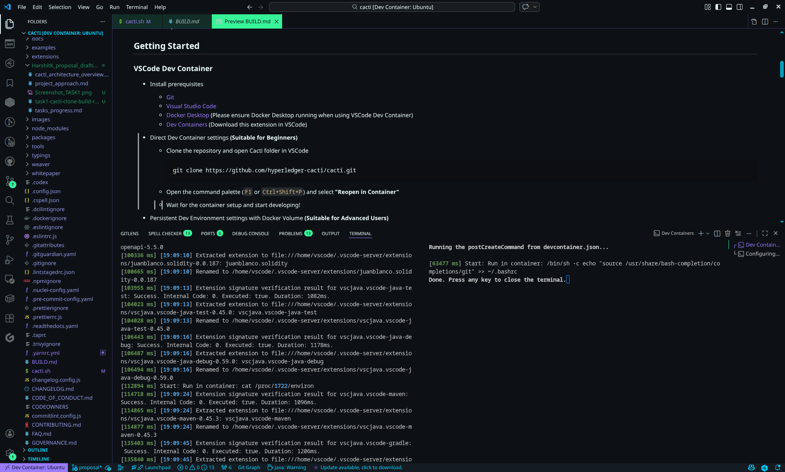
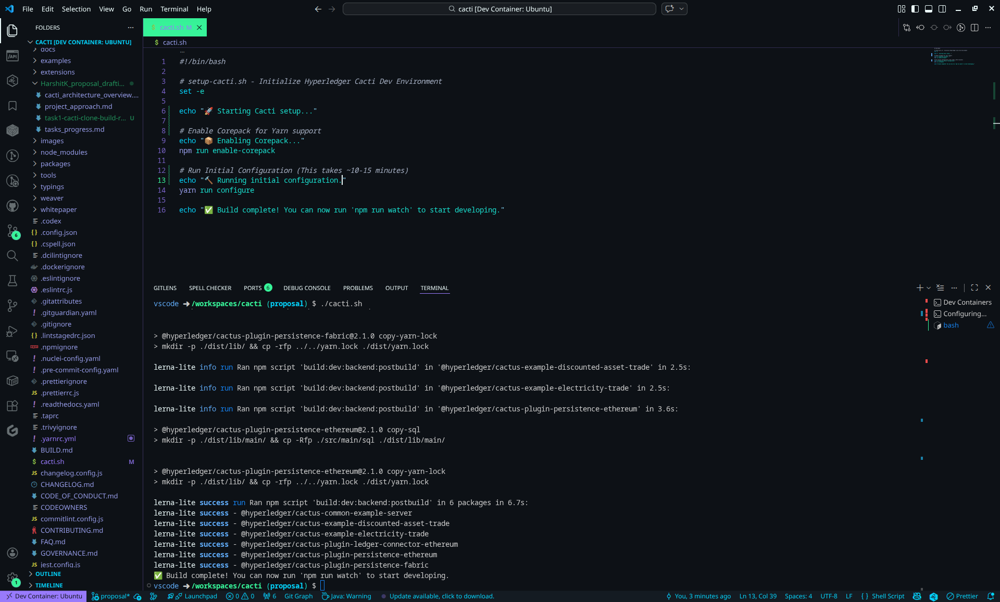
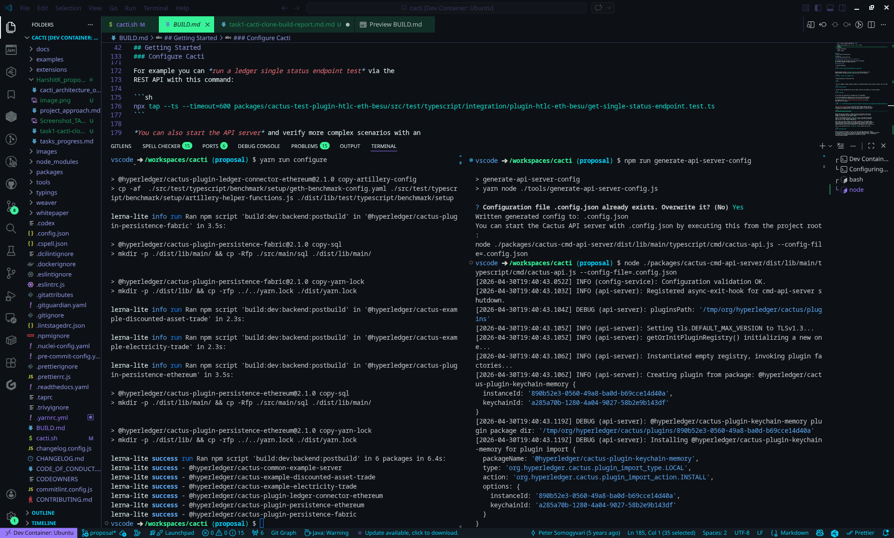
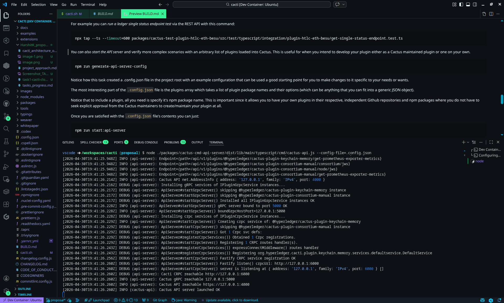
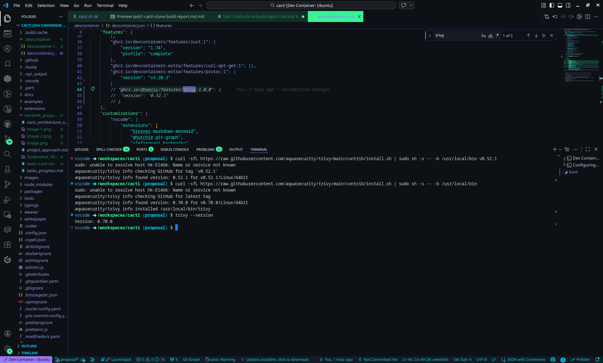
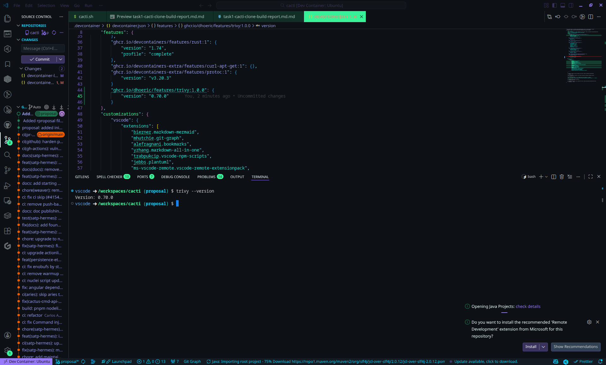

 
# Clone + Build Cacti Report

## Project understanding
From my understanding, Hyperledger Cacti is a plaggable tool that lets different blockchains talk to each other and share information without having to merge into a single network.
Basically it solves the problem of fragmentation in blockchain domain, where each ledger is isolated and developers would otherwise have to build custom integrations for every network pairs. 
Cacti uses plugins and connectors, so new ledgers can be supported without redesigning the whole system.

## My Build experience
I built Hyperledger Cacti by first cloning the repository, then opening it in VS Code and building it inside the Dev Container to match the project’s expected setup as mentioned in BUILD.md  .

I immediately ran into issues and on analysing the logs, I found out that Trivy feature installation was failing inside the Dev Container. I tried manual installation and found that the version in devcontainer.json was broken. I edited it to newer version in devcontainer.json and ran it again.

Another issue I hit was the Linux file-watch limit. I confirmed later that this is a known Cacti problem from the project FAQ and fixed it by increasing  inotify watches and reloading sysctl, which let the watcher system handle the repository’s size. I feel this should have been mentioned in BUILD.md under a seperate troubleshooting steps section.
 
After those fixes, I ran `yarn run configure` and completed the build successfully, which compiled the core Cacti packages and prepared the workspace for development. I then generated the API server configuration with `npm run generate-api-server-config` and launched the API server to verify the build end-to-end; the server reported that Cacti API was reachable and launched OK. 
In short, the build process was not quite a single click experience, there were many issues that came up along the way. I treated each failure as a systems problem, used the project docs and logs to identify the root cause, and kept iterating until the monorepo was fully built and the API server was running.

# What I understood from build process
The build process basically sets up the monorepo’s development environment inside a dev container, installs dependencies, compiles the TypeScript packages, links the internal workspace modules, and generates the runtime artifacts needed to run the API server and related services. 

### Screenshot 1

### Screenshot 2

## Screenshot 3

## Screeshot 4

 ## Screenshot 5 
 
 
 