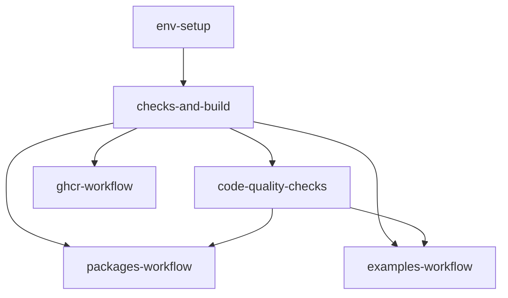
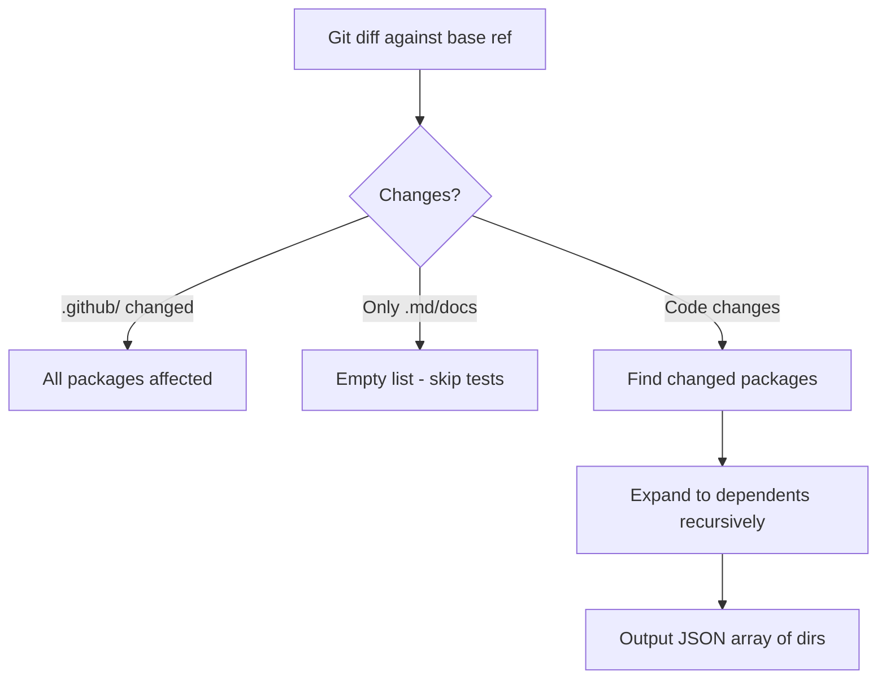

# Top-Down Breakdown of Hyperledger Cacti CI/CD

Based on the thorough file analysis, here is the complete CI/CD architecture, from the highest level down to individual jobs, with diagrams, descriptions, and a summary of inefficiencies.

---

### 1. Entry Points (Triggers)

The CI system is invoked via:
- **Pull Requests** to `main` or `dev` → `ci.yaml` (main modular pipeline)
- **Push to `main`** → both `ci.yaml` (via `workflow_dispatch`) and `ci_weaver.yaml` (legacy Weaver suite) and publish workflows triggered by tags
- **Scheduled (cron)** → `ci.yaml` twice a week, `ci_weaver.yaml` monthly, `codeql-analysis.yml` weekly, `scorecard.yml` weekly
- **Manual** → `workflow_dispatch` on `ci.yaml`, `ci_weaver.yaml`, and SATP-Hermes publish/release

---

### 2. Top-Level Architecture (Call Chain)

The primary pipeline is orchestrated by `ci.yaml`. It delegates to multiple reusable workflows. The following Mermaid diagram shows the job dependencies.



The `env-setup` job only passes environment variables. `checks-and-build` performs the build and computes affected packages. The outputs flow downstream to conditionally run tests and Docker builds.

---

### 3. Detailed Workflow Breakdown

#### 3.1 `ci.yaml` – The Orchestrator

- **Job: `env-setup`** – trivial; sets outputs for `node_version`, `run_code_coverage`, `run_trivy_scan`.
- **Job: `checks-and-build`** → calls `checks-and-build.yaml`.
- **Job: `code-quality-checks`** → calls `code-quality-checks.yaml`.
- **Job: `packages-workflow`** → calls `packages-workflow.yaml` with `affected-packages` and flags.
- **Job: `examples-workflow`** → calls `examples-workflow.yaml` similar to above.
- **Job: `ghcr-workflow`** → calls `ghcr-workflow.yaml` for Docker builds.

All jobs run on `ubuntu-22.04`.

#### 3.2 `checks-and-build.yaml` – Foundation

- **`ActionLint`** – calls `actionlint.yaml` (linting workflows).
- **`DCI-Lint`** – inclusive naming lint.
- **`check-coverage`** – outputs coverage flag (but doesn't run tests).
- **`build-dev`** – runs the `configure-repo` action, which installs dependencies (`yarn install --immutable`) and optionally runs `yarn configure` (builds all packages). No caching of compiled output.
- **`compute-changed-packages`** – runs `tools/compute-affected-packages.cjs`, which:
  1. Scans `packages/`, `examples/`, `extensions/` for package.json.
  2. Builds reverse dependency graph.
  3. Gets changed files via `git diff` against base ref.
  4. If only docs/comments, returns empty `[]`.
  5. Identifies directly changed packages and expands to dependent packages.
  6. Outputs a JSON array of affected package directories.
- **Outputs:** `affected_packages` (JSON array) and build status.

**Inefficiency:** `build-dev` recompiles everything from scratch; `.tsbuildinfo` not cached.

#### 3.3 `code-quality-checks.yaml` – Validation

Jobs run in parallel:

- **`yarn_lint`** – runs `yarn lint` (ESLint + Prettier + spellcheck). Checks for side-effects (modified files).
- **`yarn_codegen`** – runs `yarn codegen` (OpenAPI generator, protobuf, Solidity ABIs). Caches the OpenAPI JAR.
- **`yarn_custom_checks`** – runs `yarn custom-checks` (validates OpenAPI specs, package.json fields, dependency versions, etc.).
- **`yarn_tools_validate_bundle_names`** – `continue-on-error: true`.

All jobs use `configure-repo` with `configure_desable: true` to skip the full build. But they still install dependencies from scratch, without caching `node_modules`.

#### 3.4 `packages-workflow.yaml` – Package Tests Orchestrator

Calls sub-workflows in parallel:

- **`core-packages`**
- **`connector-packages`**
- **`keychain-packages`**
- **`other-packages`**
- **`satp-hermes-workflow`** – conditional: only if `affected-packages` contains `packages/cactus-plugin-satp-hermes`.

Each sub-workflow receives `affected-packages` and likely has its own matrix/job definitions. Those sub-workflows (like `core-packages-workflow.yaml`) are not individually analyzed but follow the pattern of using `configure-repo` and running tests.

**Inefficiency:** Even if no packages in a category are affected, the sub-workflow is still called, consuming a runner and doing some setup. For example, `core-packages` always runs, though it may skip tests internally.

#### 3.5 Weaver Integration Tests (called by `ci_weaver.yaml`)

`ci_weaver.yaml` is a standalone pipeline that triggers on push/PR to `main`, monthly schedule, and manual dispatch. It calls all Weaver test workflows unconditionally:

```
fabric-fabric-satp, asset-exchange-corda, asset-transfer, relay, corda-interop-app,
pre-release, asset-exchange-fabric, data-sharing, node-pkgs, docker-build,
asset-exchange-besu, go
```

Each of those workflows (e.g., `test_weaver-data-sharing.yaml`) contains multiple jobs:
- `check_code_changed` – uses `dorny/paths-filter` to detect if Weaver files changed.
- `data-sharing` (or similar) – the actual test, often with a disabled `if: false` variant and two jobs: `*-docker-local` (using Docker containers) and `*-local` (building from source). Both jobs duplicate the entire network setup and test logic.

**Inefficiency:** Massive duplication, hardcoded sleeps, no caching, dead code (`if: false` jobs).

#### 3.6 SATP-Hermes Workflows (Fragmented)

**`satp-hermes-workflow.yaml`** (called by `packages-workflow.yaml`):
- Runs **9 test jobs in parallel** (unit, bridge, oracle, gateway, docker, on-chain, recovery, rollback, etc.).
- Each job pulls heavy Docker images independently (no shared pre-pull).
- Uses `jest-runner` action for reporting.

**Other SATP-Hermes files** are standalone callable workflows:
- **`satp-hermes-build.yaml`** – installs, builds, uploads artifacts.
- **`satp-hermes-lint.yaml`** – downloads artifacts, runs lint.
- **`satp-hermes-codegen.yaml`** – downloads artifacts, generates code.
- **`satp-hermes-publish.yaml`** – **rebuilds the Docker image three times**: once in `build-satp-docker`, then again fully in `publish-satp-image-ghcr` and again in `publish-satp-image-dockerhub`.
- **`satp-hermes-release.yaml`** – creates a GitHub release.

**Inefficiency:** Extreme duplication, 7 workflow files doing overlapping setup, Docker image built multiple times, no shared caching between them.

#### 3.7 Docker Builds (`ghcr-workflow.yaml`)

Called by `ci.yaml`, this builds several Docker images conditionally based on changed files or affected packages:
- `besu-all-in-one`, `corda-all-in-one-flowdb`, `dev-container-vscode`, `example-supply-chain-app`, `fabric2-all-in-one`, `daml-all-in-one`, `keychain-vault-server`.

Each job checks changes (via `git diff` or `affected-packages`) and runs `docker build` with `DOCKER_BUILDKIT=1`. No layer caching across builds.

**Inefficiency:** Fabric image build takes 15-20 min; no remote cache. The `keychain-vault-server` image is built but not pushed to correct registry.

#### 3.8 Tag-Based Publish Workflows

Separate workflows like `fabric2-all-in-one-publish.yaml` and `besu-all-in-one-publish.yaml` build and push Docker images on `v*` tags. They also lack caching and use manual `docker build`/`push`.

---

### 4. Custom GitHub Actions (Reusable Components)

- **`configure-repo`** – The core setup action:
  1. `actions/setup-node` with `cache: yarn` (caches global Yarn cache).
  2. `corepack enable` to ensure Yarn.
  3. Manual `actions/cache` for `~/.cache/yarn` (possibly redundant).
  4. `yarn install --immutable` (installs dependencies from lockfile).
  5. If `configure_desable != 'true'`, runs `yarn configure` (builds all). No caching of compiled output.
- **`jest-runner`** – Runs Jest with optional coverage and JUnit reporting. **Bug:** Two identical steps for coverage, causing double test runs; variable name mismatch (`report-name` vs `report_name`).
- **`docker-pull`** – Pre-pulls Docker images for integration tests.
- **`tape-runner`** – Legacy Tape test runner.

---

### 5. Affected Packages Logic (Smart Selection)

The script `compute-affected-packages.cjs` is the brain of conditional execution.



This output is passed as a JSON string to downstream workflows, which then use `contains(fromJson(inputs.affected-packages), '...')` to decide whether to run.

**Current gap:** The `packages-workflow.yaml` always invokes sub-workflows even if their category is not affected, though the sub-workflows may skip tests internally. A top-level check could eliminate the entire call.

---

### 6. Key Inefficiencies Summary (Mapped to Improvements)

| Inefficiency | Proposed Fix | Impact |
|-------------|--------------|--------|
| No caching of node_modules or .tsbuildinfo | Use `actions/cache` in `configure-repo` for local cache | 50-70% install/build time reduction |
| Build and lint/codegen run serially | Decouple in `ci.yaml`; lint/codegen only needs deps | 15% wall-clock time |
| SATP-Hermes 7 workflow files, repeated installs, image rebuilt 3x | Consolidate into one, reuse cached build, fix publishing | 60% SATP PR time |
| Weaver test jobs duplicated, hardcoded sleeps | Matrix-based consolidation, health checks | 20% test time |
| Doc-only PRs still run heavy jobs | Wire doc-only early exit into top-level pipeline | Doc PRs <10 min |
| Docker builds without layer caching | Add `cache-from/cache-to` with `type=gha` | 70% image build time |
| `jest-runner` double-run bug | Remove duplicate step | 50% test time for coverage jobs |
| `actionlint` workaround deletes half the repo | Use direct binary install | Robustness |
| `deploy_docs` runs full monorepo build | Only install necessary packages | 5-8 min saved |

---

### 7. Flow Summary

**For a typical pull request to main:**
1. `ci.yaml` triggers.
2. `env-setup` passes parameters.
3. `checks-and-build` runs: lints, builds everything, computes affected packages (e.g., `["packages/cactus-core"]`).
4. `code-quality-checks` runs lint, codegen, custom checks in parallel (after build).
5. `packages-workflow` runs tests for core, connectors, etc. Only SATP-Hermes is gated by affected list.
6. `ghcr-workflow` builds Docker images only if relevant files changed.
7. `examples-workflow` tests examples.
8. If only docs changed, affected list empty; ideally the pipeline would skip steps 5-7, but currently they still run empty.

**For SATP-Hermes changes:**
- `affected-packages` includes `packages/cactus-plugin-satp-hermes`.
- `packages-workflow` triggers `satp-hermes-workflow.yaml`, which runs 9 test jobs in parallel.
- Separately, the SATP build/lint/publish workflows might be invoked via `workflow_dispatch` or automated pushes to release branches (causing triple Docker builds).

**For Weaver changes:**
- `ci_weaver.yaml` on push to main runs all Weaver test workflows (with `run_all=false` for PRs, so only lightweight checks).
- Main `ci.yaml` also triggers `packages-workflow` but Weaver packages are not fully integrated into affected-package detection? Weaver code lives under `weaver/` and its packages are in workspace but `compute-affected-packages.cjs` only scans `packages/`, `examples/`, `extensions/`. So Weaver-only changes would show empty affected list. However, `ci_weaver.yaml` separately ensures Weaver tests run on main, so it's a workaround. This disconnect is another opportunity for unification.

---

### 8. Next Steps (In Proposal)

Based on this deep understanding, the mentorship proposal can now precisely articulate

# CI/CD Bottlenecks – Hyperledger Cacti

Based on the in‑depth analysis of 32 workflow/script/action files, here are the top bottlenecks, organised by category. Each entry includes the **location**, **impact**, and **proposed fix** (which will feed into your mentorship deliverables).

### 1. Dependency & Build Caching (Largest Single Improvement)

| Bottleneck | Location(s) | Impact | Proposed Fix |
|------------|-------------|--------|--------------|
| **No local cache for `node_modules` or `.tsbuildinfo`** | `configure-repo/action.yaml`, all workflows using it | Every job reinstalls dependencies from scratch (3–4 min) and recompiles the entire project (5–8 min). Even doc‑only changes trigger a full build. | Add `actions/cache` for `node_modules` (or `.yarn/cache` with Yarn PnP) and for TypeScript build outputs (`.tsbuildinfo` + `dist/`). Key can be composite of `yarn.lock`, OS, and commit SHA for incremental rebuilds. |
| **Inefficient SATP‑Hermes builds** | `satp-hermes-build.yaml`, `satp-hermes-lint.yaml`, `satp-hermes-codegen.yaml` | Each file repeats `yarn install` and `yarn configure` independently, even though `satp-hermes-workflow.yaml` already has a build job. The lint/codegen jobs also download unnecessary build artifacts (dist). | Consolidate into a single `satp-hermes-ci.yaml` workflow where a build job runs once and subsequent jobs (lint, codegen, test) reuse the cached `node_modules` and generated artifacts via artifacts or cache. |
| **`configure-repo` action** | `.github/actions/configure-repo/action.yaml` | It always runs `yarn configure` (which builds everything) unless `configure_desable` is set. It does not cache build outputs. | Split into an install step (cached) and a compile step (incremental). Use a unique cache key that includes the hash of all relevant source files. |

### 2. Pipeline Topology (Job Dependencies)

| Bottleneck | Location(s) | Impact | Proposed Fix |
|------------|-------------|--------|--------------|
| **Linear execution: build → lint/codegen → test** | `ci.yaml` | Lint and codegen are blocked by the full build, even though they only need `node_modules`. This adds 8–10 minutes to the critical path. | Decouple. Make `code-quality-checks` depend only on a fast “install‑deps” job, not the full `checks-and-build`. Run lint/codegen in parallel with the build. Tests then wait for both the build and the quality checks to complete. |
| **`packages-workflow.yaml` always invokes sub‑workflows** | `packages-workflow.yaml` | Even when no package in a category is affected, the sub‑workflow is still called, consuming a runner for environment setup. | Pass `affected-packages` and add a conditional `if` at the workflow call level, or inside the sub‑workflow’s first job, to exit early when no affected packages exist. |

### 3. Workflow Fragmentation & Duplication

| Bottleneck | Location(s) | Impact | Proposed Fix |
|------------|-------------|--------|--------------|
| **SATP‑Hermes split across 7 separate files** | `satp-hermes-build.yaml`, `satp-hermes-lint.yaml`, etc. | Hard to maintain, heavy duplication of setup steps, and no reuse of build artifacts across build → lint → codegen → publish. | Merge into one `satp-hermes-ci.yaml` with jobs: build, lint, codegen, test (unit + integration matrix), publish. Use GitHub Actions cache to share build outputs between jobs. |
| **Docker image rebuilt 3 times in SATP publish** | `satp-hermes-publish.yaml` | The `build-satp-docker` job builds the image, but then `publish-satp-image-ghcr` and `publish-satp-image-dockerhub` rebuild the entire application from scratch. This triples the build time (20–30 min total). | Build once, export the image as a tar artifact, then push jobs simply load and push. Or use `docker/build-push-action` with `cache-from` and build only the `dist/` layers in later jobs (by copying the pre‑built dist from the build job). |
| **Weaver test workflows duplicated** (data‑sharing, asset‑transfer, local, docker‑local) | `test_weaver-data-sharing.yaml`, `test_weaver-asset-transfer.yaml`, similar files | Each protocol has 2–3 almost identical jobs with the same network setup, relay/driver startup, and test patterns. This bloats YAML and makes maintenance harder. | Consolidate into a single `test_weaver-protocols.yaml` with a matrix of `{protocol, mode}`. Extract common setup steps into reusable workflows or composite actions. |
| **Legacy dead code** | `ci_weaver.yaml` (separate pipeline), `test_weaver-*.yaml` jobs with `if: ${{ false }}` | Unused code clutters the repo and confuses contributors. | Remove dead test jobs. Integrate the scheduled Weaver run from `ci_weaver.yaml` into the main `ci.yaml` as a cron‑only job, eliminating a top‑level workflow. |

### 4. Docker Image Builds

| Bottleneck | Location(s) | Impact | Proposed Fix |
|------------|-------------|--------|--------------|
| **No Docker layer caching** | `ghcr-workflow.yaml`, all publish workflows, `Dockerfile_v2.x` | Each build pulls base images and rebuilds all layers. The Fabric all‑in‑one image (20+ minutes) is especially expensive. | Use `docker/build-push-action` with `cache-from: type=gha` and `cache-to: type=gha,mode=max`. For the Fabric Dockerfile, refactor to multi‑stage builds and use `RUN --mount=type=cache` for package managers and downloaded files. |
| **Inefficient Fabric Dockerfile** | `tools/docker/fabric-all-in-one/Dockerfile_v2.x` | Installs packages individually, downloads Go manually, pre‑freezes all Fabric images. Lacks layer re‑use. | Merge `apk add` commands, copy Go from a `golang` image, move SSH keygen to entrypoint, and cache downloaded tarballs with BuildKit mounts. |
| **Build but not publish in `ghcr-workflow`** | `ghcr-workflow.yaml` (e.g., `keychain-vault-server`) | The image is built for validation but never pushed. The naming uses `cactus-` instead of `cacti-`. | Either push the image or remove the job if it’s not needed; fix naming to `cacti-`. |

### 5. Testing Inefficiencies

| Bottleneck | Location(s) | Impact | Proposed Fix |
|------------|-------------|--------|--------------|
| **`jest-runner` double‑run bug** | `.github/actions/jest-runner/action.yaml` | Two identical steps run Jest with coverage when `run_code_coverage == 'true'`. Doubles test time for all jobs using this action. | Remove the duplicate step. Fix the inconsistent variable name (`report-name` vs `report_name`). |
| **Hardcoded `sleep` in Weaver tests** | `test_weaver-data-sharing.yaml`, `test_weaver-asset-transfer.yaml` | Tests wait a fixed time (e.g., `sleep 30`) for networks to become ready. This is unreliable and wastes time. | Replace with a retry loop that checks Docker container health (e.g., `docker inspect --format='{{.State.Health.Status}}'`) or specific service endpoints. |
| **Weaver test jobs duplicate network setup** | `*-docker-local` and `*-local` jobs | Each test protocol and each mode (Docker vs native) repeats the same 15–20 setup steps (Corda network, Fabric network, relay, driver, IIN agent). | Extract a common “setup test environment” action/reusable workflow that accepts parameters (protocol, mode). Then the test‑specific job only adds the few lines that differ. |

### 6. Monitoring, Hygiene & Security

| Bottleneck | Location(s) | Impact | Proposed Fix |
|------------|-------------|--------|--------------|
| **`actionlint` workaround** | `.github/workflows/actionlint.yaml` | Deletes half the repository (`packages/`, `examples/`, etc.) and a whole workflow file to avoid npm conflicts and false positives. This is fragile and slow. | Install `actionlint` as a standalone Go binary (no npm). Fix the excluded Weaver workflows and add inline shellcheck directives for false positives. |
| **CodeQL Autobuild** | `.github/workflows/codeql-analysis.yml` | Autobuild may fail or produce incomplete results for a monorepo, reducing the effectiveness of security scanning. | Replace with explicit steps: `yarn install` and `yarn build:dev:backend`. |
| **`deploy_docs.yml` runs full build** | `.github/workflows/deploy_docs.yml` | Calls `npm run configure` (full monorepo build) just to publish static docs. Wastes 5–8 minutes. | Run only `yarn install` and the specific diagram‑generation steps. |

---

### Summary of Bottleneck Severity

```
Severity   Category                       Est. Waste per PR
───────────────────────────────────────────────────────────
Critical   No dependency/Build caching    10–12 min
Critical   SATP-Hermes fragmentation      15–20 min (publish)
High       Linear build → lint/test       4–6 min
High       Fabric Dockerfile rebuild      15–20 min
Medium     Weaver test duplication        3–5 min
Medium     jest-runner double‑run         2–4 min
Low        actionlint workaround          1–2 min
Low        Doc PRs not early‑exiting      5–8 min
```

Addressing these bottlenecks in order can reduce the total CI time for a typical pull request from **30–45 minutes to under 15 minutes**, a **>60% improvement**. This makes them perfect, high‑impact targets for the mentorship “CI/CD improvements reducing pipeline runtime and complexity.”

---

### 9. Alignment with Mentorship Goals (from `researches/task.md`)

This CI/CD audit directly supports the "Cacti cleanup" initiative and aligns with the following mentorship goals:

- **Optimize the CI/CD pipelines by reducing runtime and costs:** The core focus of this audit is to identify and propose fixes for inefficiencies that contribute to long pipeline runtimes and unnecessary resource consumption. The estimated >60% reduction in CI time per PR is a direct measure of this optimization.
- **Improve maintainability:** Consolidating fragmented workflows, removing dead code, and extracting common setup steps into reusable components will significantly improve the maintainability and readability of the CI/CD configurations.
- **Reduce complexity:** Streamlining the SATP-Hermes workflows, consolidating Weaver tests, and simplifying Docker builds directly reduce the overall complexity of the CI/CD system.
- **Enhance onboarding:** A faster, more reliable, and less complex CI/CD pipeline will provide a better experience for new contributors, as their changes will be validated more quickly and with fewer hidden issues or lengthy wait times. The proposed fixes for `actionlint` and CodeQL also contribute to a more robust and less frustrating development environment.
- **Reduce vulnerability surface:** While not directly addressed by all proposed fixes, more efficient and reliable builds, coupled with improved CodeQL analysis, implicitly support a stronger security posture by ensuring changes are thoroughly vetted and build processes are less prone to manual errors or workarounds.

By tackling the identified bottlenecks, this mentorship will directly contribute to a more efficient, robust, and developer-friendly CI/CD system for Hyperledger Cacti, fostering a healthier open-source project ecosystem.