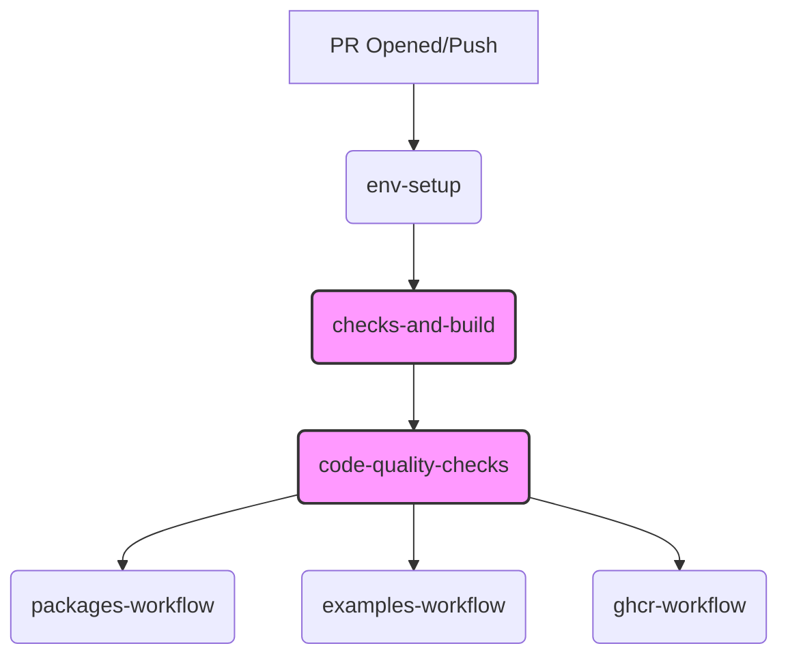
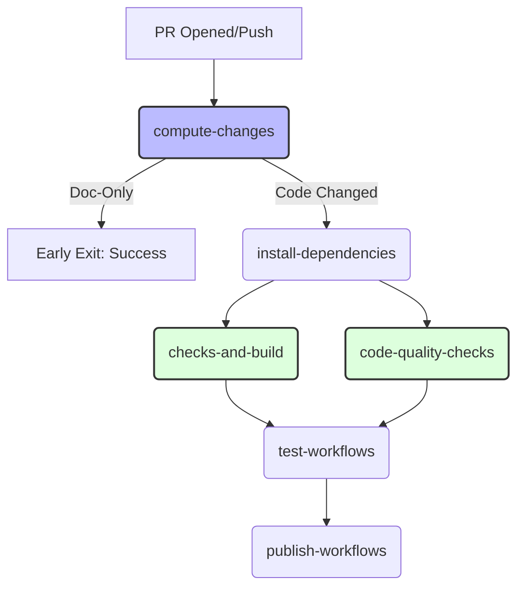

# Proposal for Hyperledger Cacti CI/CD Improvements

## 1. Introduction and Objectives

This document presents a comprehensive proposal for optimizing and refining the Continuous Integration/Continuous Delivery (CI/CD) pipelines of the Hyperledger Cacti project. The initiative is born from a meticulous audit of the existing workflows located in `.github/workflows/**` and an alignment with the broader "Cacti cleanup" initiative. Our primary objectives are:

1.  **Significantly Reduce Pipeline Runtime and Associated Costs:** By identifying and rectifying inefficiencies in build, test, and deployment processes.
2.  **Enhance Maintainability and Readability of CI/CD Configurations:** Consolidating fragmented logic, removing redundant steps, and adopting modular, reusable components.
3.  **Improve Developer Experience and Onboarding:** Providing faster, more reliable feedback loops and a less complex system for new contributors.
4.  **Increase Robustness and Reliability:** Replacing unreliable mechanisms (e.g., hardcoded sleeps) with intelligent, resilient solutions.
5.  **Strengthen Security and Quality Gates:** Ensuring static analysis and code quality checks are performed effectively and efficiently.

The current CI/CD landscape, while operational, reflects its evolutionary path stemming from the merger of Hyperledger Cactus and Weaver. This historical context has introduced architectural debt in the form of duplicated efforts, serial execution of parallelizable tasks, and suboptimal resource utilization. This proposal addresses these challenges head-on, leveraging modern GitHub Actions features and best practices to transform the Cacti CI/CD into a lean, efficient, and developer-friendly system.

## 2. Deep Dive: Existing CI Architecture and Inefficiencies

### 2.1. The Current Orchestration Flow (`ci.yaml`)
Hyperledger Cacti’s current CI architecture is centered around `ci.yaml`. This file serves as the master orchestrator, triggering a sequence of dependent workflows.

**Current Workflow Architecture Diagram:**



**Current Workflow Chain:**
1.  **`env-setup`**: A job that computes core environment settings.
2.  **`checks-and-build`**: This is a major bottleneck. It installs all dependencies (`yarn install`) and performs a full monorepo build (`yarn configure`).
3.  **`code-quality-checks`**: This job is blocked by `checks-and-build`. It performs linting and codegen only *after* the full build finishes.
4.  **Dependent Workflows**: Jobs like `packages-workflow`, `examples-workflow`, and `ghcr-workflow` wait for both of the above to complete before beginning their specific tasks (test execution, Docker image builds).

### 2.2. Critical Inefficiencies
*   **The Monolithic Build Problem:** Every job, including linting and codegen, relies on the `checks-and-build` job to be completed. This forced sequential execution is highly suboptimal.
*   **Redundant Dependency Management:** The configuration for installing dependencies is duplicated across almost every workflow file, and without persistent caching, it is executed multiple times per CI run.
*   **Maintenance Burden:** The orchestration is highly rigid. Changes to the build pipeline often require manual, complex updates across multiple `*.yaml` files.
*   **Lack of Intelligent Triggering:** Every PR triggers a full suite of build and test jobs, even if changes are isolated or non-code (e.g., docs updates).
*   **Docker Inefficiency:** Lack of Docker layer caching forces full image rebuilds.
*   **Flakiness:** Use of hardcoded `sleep` commands.
*   **Fragile Workarounds:** `actionlint` deletes repo files to avoid conflicts, which is non-idiomatic and brittle.

## 3. Proposed Solutions

We propose a phased, modular overhaul to transform the workflow orchestration.

### 3.1. Proposed CI Architecture Diagram



### 3.2. Enhancing Dependency & Build Caching
We will implement persistent caching for `node_modules` and build artifacts (`dist/`, `.tsbuildinfo`).

**Before:**
```yaml
- name: Install dependencies
  run: yarn install
```
**After:**
```yaml
- name: Restore Yarn Cache
  uses: actions/cache@v4
  with:
    path: ./.yarn/cache
    key: ${{ runner.os }}-yarn-${{ hashFiles('**/yarn.lock') }}
- name: Install dependencies
  if: steps.yarn-cache.outputs.cache-hit != 'true'
  run: yarn install --immutable
```

### 3.3. Parallelizing Tasks
We will decouple `checks-and-build` and `code-quality-checks` jobs in `ci.yaml` by adding a lightweight `install-dependencies` job, allowing quality gates to run in parallel with the main build.

### 3.4. Consolidating SATP-Hermes Workflows
Consolidate seven scattered SATP-Hermes workflows into one modular `satp-hermes-ci.yaml` using a matrix strategy to manage build, lint, test, and publish stages.

### 3.5. Docker Layer Caching
Use `docker/build-push-action` with `cache-from: type=gha` and `cache-to: type=gha,mode=max` to reuse image layers across builds, avoiding redundant work for base layers.

### 3.6. Consolidating Weaver Test Workflows
Consolidate all Weaver integration tests into `test-weaver-protocols.yaml` using a matrix strategy to run different protocols and modes, backed by a composite action `weaver-test-setup`.

### 3.7. Doc-Only Early Exit
Add a `compute-changes` job in `ci.yaml`. If only documentation files are modified, skip heavy CI jobs and signal immediate success.

### 3.8. Fixing `jest-runner`
Refactor `jest-runner/action.yaml` to ensure Jest runs exactly once with the appropriate coverage flag.

### 3.9. Robust Weaver Test Waits
Replace hardcoded `sleep` durations with dynamic retry loops using health checks (e.g., `docker inspect`, `curl`) to confirm service readiness.

### 3.10. Streamlining `actionlint`
Replace destructive file-wiping with direct binary installation and `git ls-files` filtering for robust linting.

### 3.11. Optimizing Docs Deployment
Restrict `deploy_docs.yml` to only the necessary installation and diagram-building steps, avoiding full monorepo builds.

### 3.12. CodeQL Optimization
Replace CodeQL's `Autobuild` with explicit `yarn build:all` commands to ensure the entire monorepo is correctly compiled and analyzed.

### 3.13. Dead Code Removal
Remove all jobs disabled with `if: false` and merge Weaver-related schedules into the main pipeline.

## 4. Expected Impact

* Pipeline Runtime: Estimated >60% reduction.
* Infrastructure Costs: Direct reduction in runner usage.
* Maintainability: Simplified, modular, and DRY configurations.
* Reliability: Intermittent failures due to network timing will be eliminated.
* Security: More complete and effective vulnerability scans.

## 5. Conclusion
This modernization roadmap ensures the long-term maintainability and performance of the Hyperledger Cacti CI/CD framework. Implementing these improvements will foster a more efficient, developer-centric, and robust ecosystem for contributors.
