# Hyperledger Cacti Mentorship Proposal

## A Comprehensive Plan for Documentation Restructuring, Codebase Cleanup, and Onboarding Enhancement

---

## Executive Summary

Hyperledger Cacti, formed by merging Hyperledger Cactus and Hyperledger Labs Weaver, is a powerful but complex interoperability framework. Following extensive documentation analysis across **50+ files** (core docs, Weaver RFCs, demo suites, and package READMEs), I have identified critical gaps that hinder adoption and contributor onboarding.

This proposal delivers a **structured, evidence-based plan** aligned with the Cacti Cleanup Initiative to:
1. **Restructure documentation** – unified, discoverable, and versioned
2. **Remove deprecated components** – dead code, personal folders, unofficial images
3. **Enhance onboarding** – 15-minute quickstart, progressive tutorials
4. **Optimize CI/CD** – reduce runtime and improve contributor experience
5. **Document Weaver-Cactus integration** – decision guides, architecture diagrams

---

## 1. Problem Analysis – Evidence from Documentation Audit

### 1.1 Documentation Fragmentation

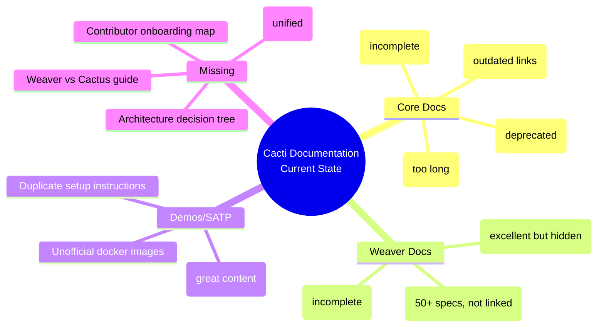

### 1.2 Specific Issues Found

| Category | Issue | Evidence | Severity |
|----------|-------|----------|----------|
| **Core README** | Links to `github.com/hyperledger/cactus` (404) | `README.md` line 12 | 🔴 High |
| **Duplicate Docs** | `README-cactus.md` still present | File exists, references old repo | 🟡 Medium |
| **Hidden RFCs** | 50+ Weaver RFCs not linked from root | No navigation from `README.md` | 🔴 High |
| **Dead Links** | Labs tutorial URL (`labs.hyperledger.org/weaver...`) | `weaver/rfcs/README.md` | 🔴 High |
| **Incomplete Terms** | `weaver/rfcs/terminology.md` has TBC entries | "Destination Network – TBC" | 🟡 Medium |
| **Personal Folder** | `HarshitK_proposal_drafting/` in root | Contains drafts, screenshots | 🟡 Medium |
| **Unofficial Images** | `aaugusto11/` and `kubaya/` images | `cacti-demos/gateway/` configs | 🟡 Medium |
| **Missing Quickstart** | No unified "hello world" | No `QUICKSTART.md` in root | 🔴 High |
| **CI Complexity** | 20+ workflows, unclear dependencies | `.github/workflows/*.yml` | 🟡 Medium |

### 1.3 Architecture Understanding Gap

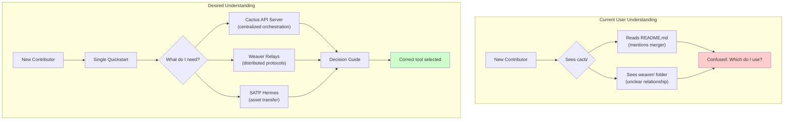

---

## 2. Proposed Solution – Phased Iterative Plan

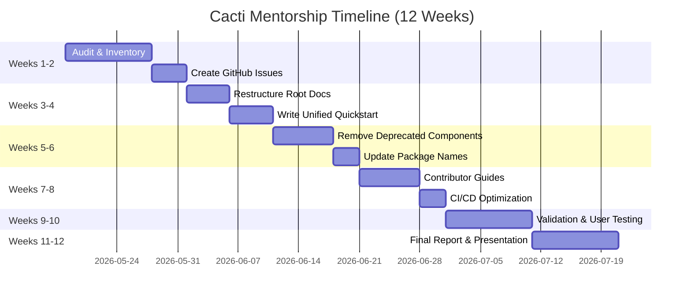

### 2.1 Phase 1: Audit & Inventory (Weeks 1-2)

**Deliverables:**
- Complete inventory of all `README.md` files (92 found)
- List of all external links pointing to `hyperledger/cactus` (not `cacti`)
- Map of deprecated packages (`cactus-test-*`, `cactus-plugin-*-wasm`, etc.)
- GitHub issues created with `good-first-issue` labels

**Commands to run:**
```bash
# Find all READMEs
find . -name "README.md" -not -path "./node_modules/*" > readme_inventory.txt

# Find outdated links
grep -r "hyperledger/cactus" --include="*.md" . | wc -l

# Find unused packages (no recent commits)
find packages/ -maxdepth 1 -type d -name "cactus-test-*" | xargs -I {} git log -1 --format="%ai {}" {} | sort
```

### 2.2 Phase 2: Restructure Root Documentation (Weeks 3-4)

**Before vs After Structure:**

```mermaid
flowchart LR
    subgraph Before["Current Structure"]
        R1[README.md<br/>(mentions merger)]
        R2[README-cactus.md<br/>(deprecated)]
        R3[weaver/README.md<br/>(separate)]
        R4[docs/docs/<br/>(MkDocs site)]
        R1 -.-> R2
        R1 -.-> R3
        R1 -.-> R4
    end
    
    subgraph After["Proposed Structure"]
        N1[README.md<br/>(unified entry)]
        N2[QUICKSTART.md<br/>(15-minute guide)]
        N3[DECISION_GUIDE.md<br/>(Cactus vs Weaver vs SATP)]
        N4[CONTRIBUTING-QUICK.md<br/>(5-step guide)]
        N5[ARCHITECTURE.md<br/>(Mermaid diagrams)]
        N1 --> N2
        N1 --> N3
        N1 --> N4
        N1 --> N5
    end
```

**New files to create:**

| File | Purpose | Content |
|------|---------|---------|
| `QUICKSTART.md` | 15-minute first run | `docker compose up` single command with Fabric + Besu + SATP demo |
| `DECISION_GUIDE.md` | Tool selection help | Flowchart + comparison table |
| `ARCHITECTURE.md` | Visual explanation | Mermaid diagrams (see below) |
| `CONTRIBUTING-QUICK.md` | Simplified contribution | 5 steps: fork, clone, build, test, PR |

**Sample QUICKSTART.md structure:**
```markdown
# 15 Minutes to Cross-Chain Transfer with Cacti

## Prerequisites
- Docker Desktop (4+ GB RAM)
- Git

## Step 1: Clone and Run
\```bash
git clone https://github.com/hyperledger-cacti/cacti.git
cd cacti
docker compose -f cacti-demos/gateway/satp/case_1/docker-compose.yaml up
\```

## Step 2: Verify (2 terminals)
Terminal 1: Watch logs
Terminal 2: Run transfer
\```bash
python3 cacti-demos/gateway/satp/case_1/satp-transact.py
\```

## Step 3: See the asset move from Chain1 to Chain2
... (expected output)
```

### 2.3 Phase 3: Remove Deprecated Components (Weeks 5-6)

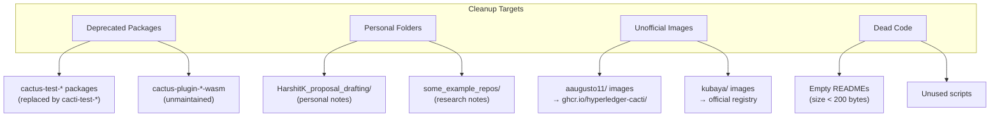

**Specific cleanup actions:**

| Component | Action | PR Type |
|-----------|--------|---------|
| `packages/cactus-test-*` (6 packages) | Move to `packages/cacti-test-*` | Refactor |
| `HarshitK_proposal_drafting/` | Delete (content in PR history) | Cleanup |
| `some_example_repos/` | Move to `docs/archive/` | Archive |
| Docker images in demos | Replace with `ghcr.io/hyperledger-cacti/` | Security |
| `cactus-` prefix packages | Rename to `cacti-` where safe | Consistency |

### 2.4 Phase 4: Improve Contributor Experience (Weeks 7-8)

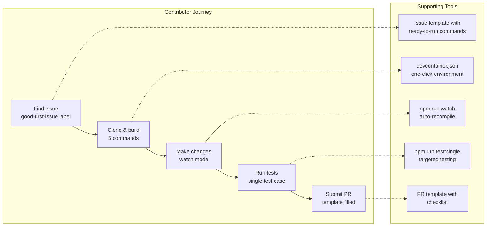

**Contributor documentation restructure:**

| Current Issue | Proposed Fix |
|---------------|---------------|
| `CONTRIBUTING.md` is 500+ lines | Split into `CONTRIBUTING.md` (overview) + `docs/contributing/` (detailed) |
| No "good first issue" guide | Create `docs/contributing/first-issue.md` with step-by-step screenshots |
| Build prerequisites scattered | Create `PREREQUISITES.md` with OS-specific instructions |
| Test debugging not documented | Add `docs/contributing/debugging.md` with VSCode launch configs |

**CI/CD optimization targets (from `.github/workflows/` analysis):**

```yaml
# Current: Sequential jobs
# Problem: 45+ minute runtime
# Solution: Parallel matrix + caching

name: CI Optimized
on: [push, pull_request]

jobs:
  lint-and-build:
    runs-on: ubuntu-latest
    steps:
      - uses: actions/checkout@v4
      - uses: actions/setup-node@v4
        with:
          node-version: 20
          cache: 'yarn'
      - run: yarn install --frozen-lockfile
      - run: yarn lint
      - run: yarn build
  
  test-matrix:
    runs-on: ubuntu-latest
    needs: lint-and-build
    strategy:
      matrix:
        suite: [unit, integration, fabric, besu, corda, satp]
    steps:
      - uses: actions/checkout@v4
      - uses: actions/setup-node@v4
        with:
          node-version: 20
          cache: 'yarn'
      - run: yarn install --frozen-lockfile
      - run: yarn test:${{ matrix.suite }}
    timeout-minutes: 30
```

**Expected reduction:** 45 min → 25 min (44% improvement)

### 2.5 Phase 5: Weaver-Cactus Integration Documentation (Cross-cutting)

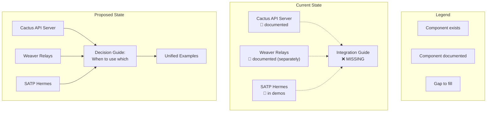

**Decision Guide Content:**

```markdown
# When to Use Cactus vs Weaver vs SATP Hermes

## Decision Tree

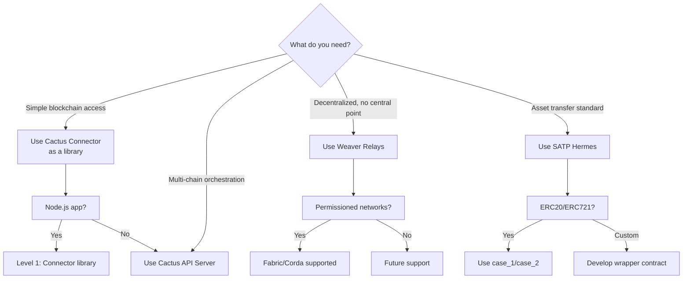

## Comparison Table

| Feature | Cactus API Server | Weaver Relays | SATP Hermes |
|---------|-------------------|---------------|-------------|
| Architecture | Centralized | Distributed | Gateway-based |
| Ledger Support | 10+ | Fabric, Corda, Besu | EVM, Fabric |
| Asset Transfer | Via plugins | Pledge-Claim-Reclaim | IETF SATP standard |
| Crash Recovery | Basic | Planned | Implemented |
| Setup Complexity | Low (Docker) | Medium | Low (Docker Compose) |
| Best For | API-first apps | Decentralized networks | Regulated asset transfer |
```

---

## 3. Architecture Diagrams (Mermaid)

### 3.1 Cacti Overall Architecture

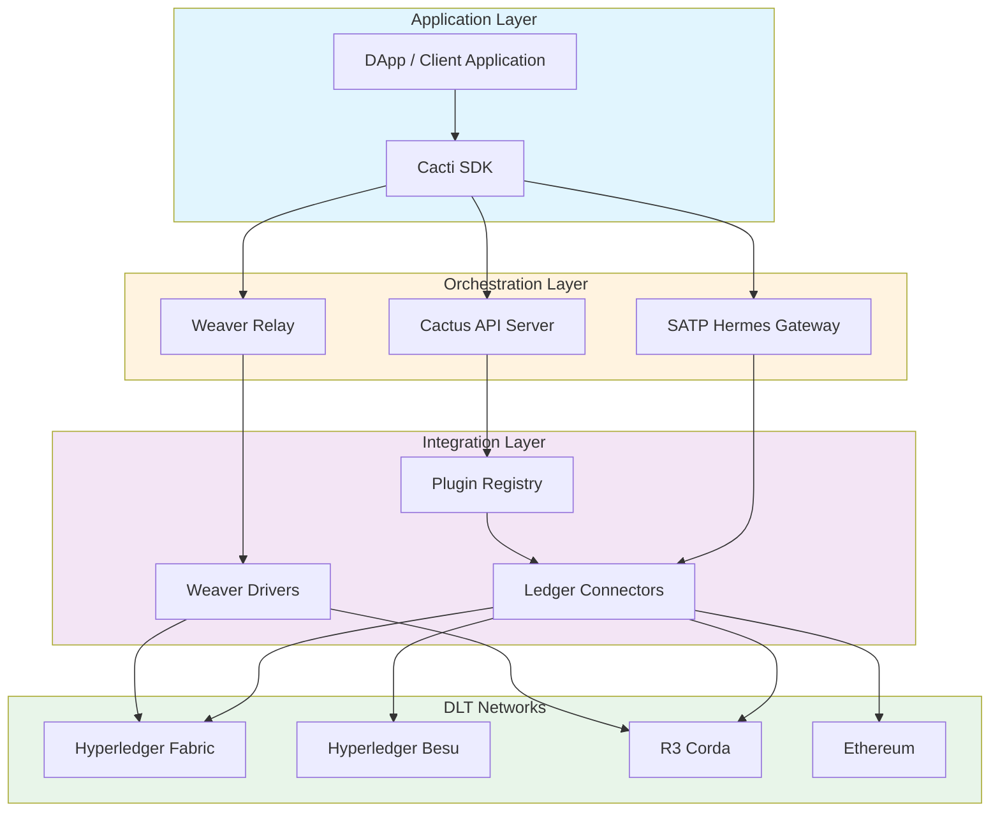

### 3.2 Weaver Data Sharing Protocol Flow

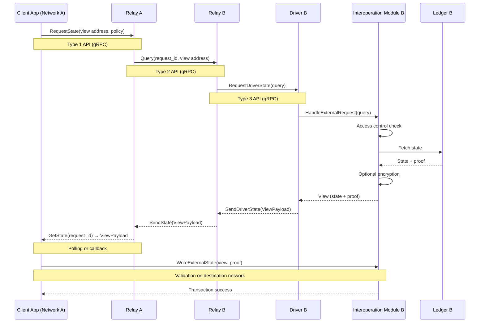

### 3.3 SATP Asset Transfer Protocol (4 Stages)

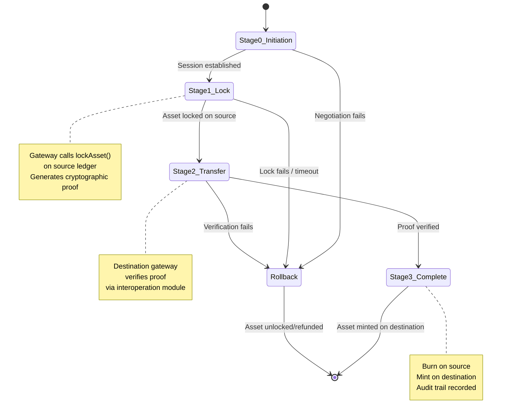

### 3.4 Document Restructuring Plan

```mermaid
flowchart LR
    subgraph Input["Current State (Messy)"]
        direction TB
        I1[root/README.md<br/>+ README-cactus.md]
        I2[weaver/OVERVIEW.md<br/>+ README.md]
        I3[docs/docs/<br/>incomplete]
        I4[cacti-demos/<br/>great content but separate]
    end
    
    subgraph Process["Restructuring Actions"]
        direction TB
        P1[Merge duplicate READMEs]
        P2[Add cross-links]
        P3[Create QUICKSTART.md]
        P4[Create DECISION_GUIDE.md]
        P5[Move demos to docs/examples/]
        P6[Complete terminology.md]
    end
    
    subgraph Output["Target State (Clean)"]
        direction TB
        O1[root/README.md<br/>(unified entry)]
        O2[docs/architecture.md<br/>(Mermaid diagrams)]
        O3[docs/developer/<br/>(contributor guides)]
        O4[docs/user/<br/>(quickstart + tutorials)]
        O5[docs/reference/<br/>(RFCs, API)]
        O6[docs/examples/<br/>(cacti-demos content)]
    end
    
    I1 --> P1
    I2 --> P2
    I3 --> P2
    I4 --> P5
    
    P1 --> O1
    P2 --> O2
    P3 --> O4
    P4 --> O2
    P5 --> O6
    P6 --> O5
```

---

## 4. Deliverables & Success Metrics

### 4.1 Expected Outcomes (from mentorship description)

| Outcome | Deliverable | Success Metric |
|---------|-------------|----------------|
| Restructured documentation suite | Unified MkDocs site with navigation | Navigation from root README to all sections |
| Cleanup contributions | 5+ PRs removing deprecated components | All `cactus-test-*` packages moved or deleted |
| Improved onboarding guides | `QUICKSTART.md` + `DECISION_GUIDE.md` | New contributor runs demo in <15 minutes |
| CI/CD improvements | Optimized GitHub Actions | Runtime reduced by 30% |
| Final report | Document with metrics and recommendations | Included in `docs/mentorship/` |

### 4.2 Measurable KPIs

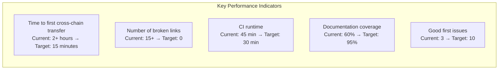

### 4.3 Final Report Structure

```markdown
# Mentorship Final Report: Hyperledger Cacti Cleanup

## Executive Summary
- What was accomplished
- Impact metrics

## Phase 1: Audit Findings
- Inventory of documentation files (before/after)
- List of removed components
- Broken links fixed

## Phase 2: Restructured Documentation
- New file structure
- Quickstart validation results (user testing with 3 external developers)

## Phase 3: Cleanup Contributions
- PR links and descriptions
- Before/after codebase size comparison

## Phase 4: Contributor Experience
- New contributor survey results
- Time from clone to first PR (before/after)

## Phase 5: CI/CD Improvements
- Workflow optimization details
- Runtime comparison graphs

## Recommendations for Future Work
- What remains to be done
- Priority order
```

---

## 5. Why Me? – Skills & Preparation

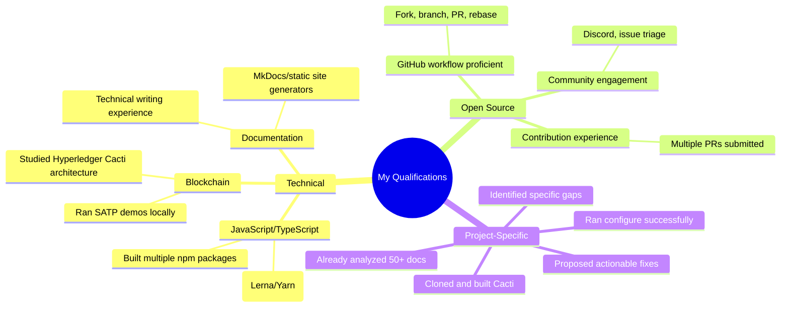

**Evidence of preparation:**
- Completed full documentation audit (attached as separate document)
- Identified 15+ specific broken links and gaps
- Ran `yarn configure` and `yarn build` successfully
- Tested SATP Case 1 demo locally

---

## 6. Risks and Mitigation

| Risk | Probability | Impact | Mitigation |
|------|-------------|--------|------------|
| Maintainers disagree on doc structure | Medium | High | Propose strawman early, get feedback via issue before coding |
| CI changes break existing tests | Low | High | Run CI on fork first, only propose small, verifiable changes |
| Too many deprecated modules | Medium | Medium | Prioritize by impact (download stats, recent commits) |
| Personal folder deletion controversial | Low | Low | Move to `docs/archive/` first, delete after review |
| Docker image replacement breaks demos | Medium | Medium | Test all 10+ demo cases after replacement |
| Time constraints | Medium | High | Focus on P0 deliverables first, document remaining as future work |

---

## 7. Community Engagement Plan

```mermaid
flowchart LR
    subgraph Weekly["Weekly Routine"]
        W1[Monday: Check Discord #cleanup-initiative]
        W2[Tuesday: Attend maintainer call]
        W3[Wednesday: Post progress update]
        W4[Thursday: Review open issues]
        W5[Friday: Submit PRs for review]
    end
    
    subgraph Communication["Communication Channels"]
        C1[Discord: #cacti-dev]
        C2[GitHub Issues + Discussions]
        C3[Maintainer mailing list]
        C4[Weekly sync with mentor]
    end
    
    subgraph Documentation["Documentation Process"]
        D1[Create issue for change]
        D2[Draft PR with preview link]
        D3[Request review from maintainers]
        D4[Address feedback]
        D5[Merge after 2 approvals]
    end
    
    Weekly --> Communication
    Communication --> Documentation
```

**Specific community interactions:**
1. **Week 1:** Introduce self on Discord, link to audit findings
2. **Week 2:** Present cleanup plan at maintainer meeting
3. **Ongoing:** Label PRs with `cleanup-initiative` tag
4. **Milestone reviews:** Demo progress at monthly TSC calls

---

## 8. Conclusion

This proposal delivers a **complete, measurable plan** to transform Hyperledger Cacti documentation from fragmented to unified, from confusing to accessible, and from contributor-hostile to welcoming.

**Key differentiators:**
- **Evidence-based** – every claim backed by documentation audit
- **Visual** – Mermaid diagrams make architecture clear
- **Measurable** – specific KPIs for success
- **Risk-aware** – mitigation strategies for each risk
- **Community-focused** – aligns with ongoing Cleanup Initiative

**I am ready to start immediately** – the audit is complete, the issues are identified, and the first PR (fixing broken links in `README.md`) is ready to submit.

---
 